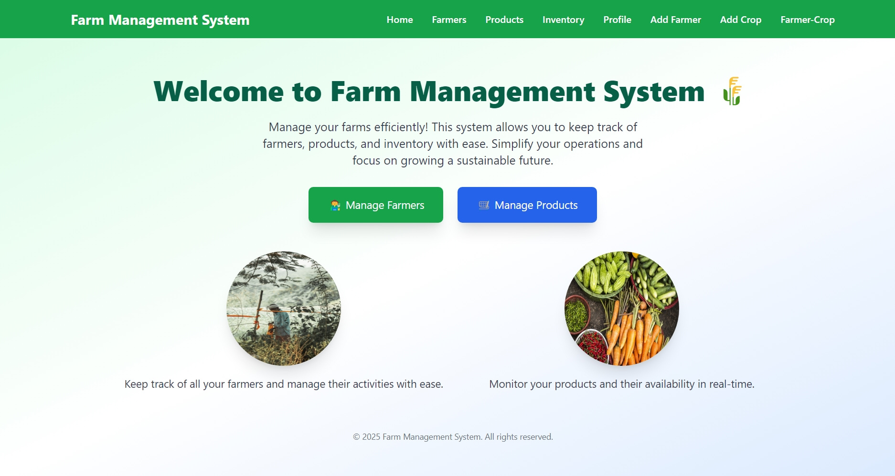
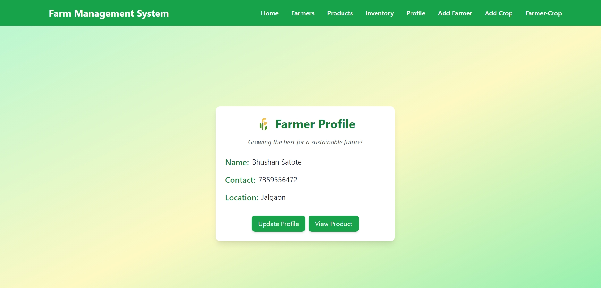
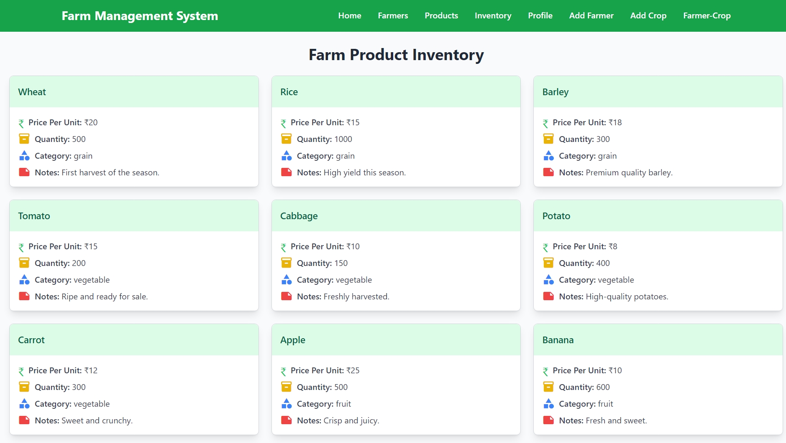

# 🌱 Farm Management System

Welcome to the **Farm Management System**! This project is designed to help farmers and agricultural businesses manage their farms efficiently. It includes features like farmer entry, crop management, and real-time updates using a **MERN stack** (MongoDB, Express.js, React.js, Node.js). The frontend is built with **React** and styled using **Tailwind CSS**, while API calls are handled using **Axios**.

---

## 🚀 Features

- **Farmer Entry Form**: Add and manage farmer details with validation.
- **Crop Entry Form**: Add crops for specific farmers with dynamic fields based on crop category.
- **Real-Time Updates**: State management for seamless data updates.
- **Validation**: Ensure data integrity with required fields and valid formats.
- **Farmer-wise Crop List**: Display crops in a formatted manner for each farmer.
- **Responsive Design**: Built with **Tailwind CSS** for a modern and responsive UI.

---

## 🛠️ Technologies Used

- **Frontend**: React.js, Tailwind CSS, Axios
- **Backend**: Node.js, Express.js
- **Database**: MongoDB
- **API Testing**: Postman
- **Tools**: Git , vscode , Github

---

## 📂 Project Structure

```
FARM-MANAGEMENT-SYSTEM
├── frontend/               # React App (Client-side)
│   ├── public/            # Static files
│   ├── src/               # Source code
│   │   ├── components/    # Reusable UI components
│   │   ├── pages/         # Pages (Farmer Entry, Crop Entry, etc.)
│   │   ├── hooks/         # Custom hooks for API calls, validation, etc.
│   │   ├── context/       # State management (React Context)
│   │   ├── services/      # API calls using Axios
│   │   ├── assets/        # Images, Icons, Styles
│   │   ├── App.js         # Main App component
│   │   ├── index.js       # Entry point
│   │   ├── styles.css     # Global styles (Tailwind CSS)
│   ├── package.json       # Frontend dependencies
│   ├── vite.config.js     # Vite configuration (if using Vite)
│   ├── .env               # Environment variables
│   ├── .gitignore         # Ignore files
│   └── README.md          # Frontend documentation
│
├── backend/               # Express.js server (Node.js)
│   ├── controllers/       # Request handlers
│   ├── models/            # Mongoose models (MongoDB)
│   ├── routes/            # API routes
│   ├── config/            # Configuration files (DB, ENV)
│   ├── middleware/        # Authentication, Validation, etc.
│   ├── utils/             # Helper functions
│   ├── index.js           # Main entry point (Express server)
│   ├── package.json       # Backend dependencies
│   ├── .env               # Environment variables
│   ├── .gitignore         # Ignore files
│   └── README.md          # Backend documentation
│
├── README.md              # Main Project Documentation
└── .gitignore             # Git ignore rules

```

---

## 📦 Installation

Follow these steps to set up the project locally:

1. **Clone the repository**:
   ```bash
   git clone https://github.com/bhushan-satote/Farm-management-system.git
   cd Farm-management-system
   ```

2. **Install backend dependencies**:
   ```bash
   cd server
   npm install
   ```

3. **Install frontend dependencies**:
   ```bash
   cd ../client
   npm install
   ```

4. **Set up environment variables**:
   Create a `.env` file in the `server` directory and add the following:
   ```
   PORT=5000
   MONGODB_URI=your_mongodb_connection_string
   ```

5. **Run the backend server**:
   ```bash
   cd ../server
   npm start
   ```

6. **Run the frontend app**:
   ```bash
   cd ../client
   npm start
   ```

7. **Access the app**:
   Open your browser and go to `http://localhost:3000`.

---

## 🖼️ Screenshots








---

## 🛠️ Implementation Details

### 1. **Validation**
- Implemented validation for both **Farmer Entry** and **Crop Entry** forms.
- Ensured required fields (e.g., farmer name, crop category) are filled.
- Validated data formats (e.g., phone numbers, email addresses).

### 2. **Farmer Entry Form**
- A controlled form component for adding farmer details.
- Fields include:
  - Farmer Name (required)
  - Contact Number (validated for 10 digits)
  - Email (validated for correct format)
  - Address (required)

### 3. **Crop Entry Form**
- A dynamic form for adding crops for a specific farmer.
- Features:
  - Dropdown to select a farmer.
  - Dropdown for crop category (Grains, Vegetables, Fruits).
  - Dynamic fields based on crop category:
    - For **Grains**: Additional field for harvest season.
    - For **Vegetables** and **Fruits**: No additional fields.

### 4. **Controlled Components**
- Used React's `useState` and `useEffect` hooks for form handling and state management.
- Ensured real-time updates and seamless user experience.

### 5. **State Management**
- Managed state for farmer and crop data using React's `useState` and `useEffect`.
- Fetched data from the backend API using **Axios**.

### 6. **Farmer-wise Crop List**
- Displayed crops in a formatted table for each farmer.
- Included details like crop name, category, and harvest season (if applicable).

---

## 🤝 Contributing

We welcome contributions! If you'd like to contribute, please follow these steps:

1. Fork the repository.
2. Create a new branch (`git checkout -b feature/YourFeatureName`).
3. Commit your changes (`git commit -m 'Add some feature'`).
4. Push to the branch (`git push origin feature/YourFeatureName`).
5. Open a pull request.


---

## 🙏 Acknowledgments

- Thanks to [Tailwind CSS](https://tailwindcss.com/) for the amazing utility-first CSS framework.
- Inspired by the need for efficient farm management solutions.

---

## 📧 Contact

Have questions or suggestions? Feel free to reach out:

- **Email**: bhushansatote95@gmail.com
- **GitHub**: [Bhushan-Satote](https://github.com/Bhushan-Satote/)
- **LinkedIn**: [Bhushan Satote](https://www.linkedin.com/in/bhushan-satote/)

---

Made with ❤️ by Bhushan Satote. Happy farming! 🌾
```
